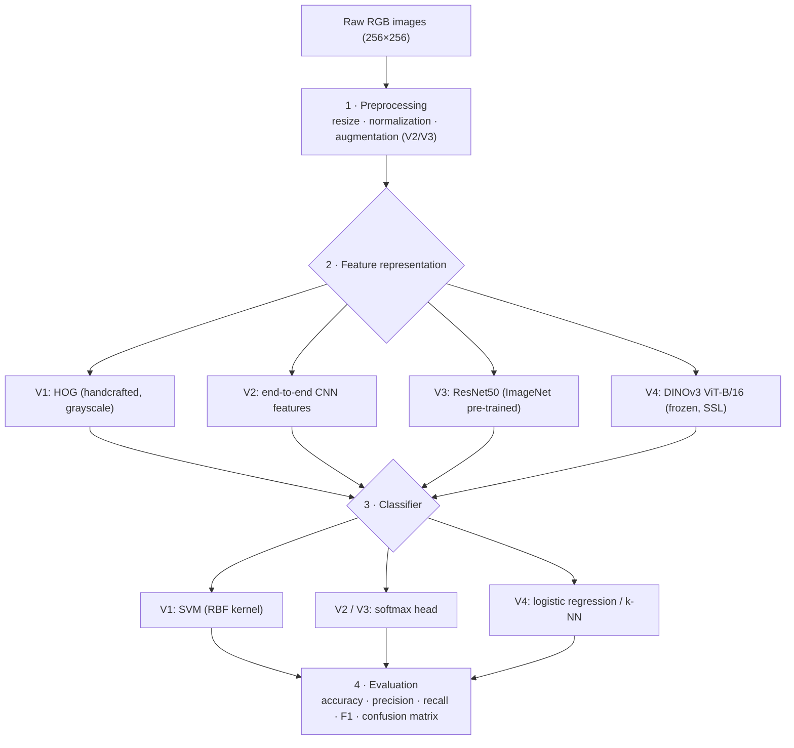

# Plant Disease Detection — Computer Vision Project

> Exam project for the Computer Vision course. A comparative study of four progressively more sophisticated approaches to plant disease classification on the **PlantVillage** dataset.

---

## Overview

Plant diseases cause an estimated 20–40% of global crop loss every year. This project builds an automated image-based classifier covering the full Computer Vision pipeline — from raw image acquisition to quantitative evaluation — and benchmarks four representative approaches on the same data:

| Version | Approach | Module covered |
|---|---|---|
| **V1** | HOG + SVM | Classical / shallow learning |
| **V2** | Custom CNN from scratch | Deep learning |
| **V3** | ResNet50 fine-tuning | Supervised transfer learning |
| **V4** | DINOv3 ViT-B/16 + linear probe | Self-supervised foundation models |

**Dataset:** New Plant Diseases Dataset (Kaggle) — a derivative of PlantVillage, 87,867 RGB leaf images, 38 classes (14 crops × healthy + disease variants). The dataset's `train/` folder (70,295 images) is used as-is; its `valid/` folder (17,572 images) is split 50/50 into validation (8,777) and test (8,795) with seed = 42 (effective split ≈ 80 / 10 / 10).

---

## Results (test set)

| Version | Accuracy | Precision | Recall | F1 | Train time | Trainable params |
|---|:--:|:--:|:--:|:--:|:--:|:--:|
| V1 — HOG + SVM | 74.39% | 74.62% | 74.39% | 74.26% | 25 min | — |
| V2 — Custom CNN | 99.66% | 99.66% | 99.66% | 99.66% | 294 min | 0.66 M |
| **V3 — ResNet50 TL** | **99.87%** | **99.88%** | **99.87%** | **99.87%** | 128 min | 16.0 M |
| V4 — DINOv3 + LinProbe | 98.35% | 98.39% | 98.35% | 98.35% | 12.5 min¹ | 0 (backbone) |

¹ V4 time is embedding extraction; the linear probe itself fits in 1.95 s.

Full analysis: [`Technical_Analysis.md`](Technical_Analysis.md) · Concise summary: [`RESULTS_SUMMARY.md`](RESULTS_SUMMARY.md).

---

## Project Structure

```text
ComputerVisionProject/
├── notebooks/
│   ├── 00_setup_and_data.ipynb            # Dataset download + val/test split
│   ├── 01_v1_hog_svm.ipynb                # V1 — HOG + SVM
│   ├── 02_v2_custom_cnn.ipynb             # V2 — Custom CNN from scratch
│   ├── 02_v2_fast_custom_cnn.ipynb        # V2 — short-schedule variant
│   ├── 03_v3_transfer_learning.ipynb      # V3 — ResNet50 fine-tuning
│   ├── 04_v4_dinov3_probe.ipynb           # V4 — DINOv3 + linear/k-NN probe
│   ├── 05_comparison_and_analysis.ipynb   # Cross-version benchmark
│   ├── 06_prepare_documentation.ipynb     # Regenerates RESULTS_SUMMARY.md
│   └── 07_leak_analysis_and_clean_eval.ipynb  # Leak quantification + clean re-evaluation
├── data/
│   ├── raw/                               # Original PlantVillage images (gitignored)
│   └── processed/                         # train/val/test splits
├── results/
│   ├── models/                            # Saved checkpoints (gitignored)
│   ├── metrics/                           # Per-version JSON + comparison CSVs
│   └── plots/                             # Confusion matrices, training curves
├── Technical_Analysis.md                  # Full 10-page report
├── RESULTS_SUMMARY.md                     # Auto-generated summary
├── requirements.txt
└── environment.yml
```

---

## Setup

### Option A — pip + venv

```bash
python -m venv .venv
source .venv/bin/activate        # Windows: .venv\Scripts\activate
pip install -r requirements.txt
```

### Option B — conda

```bash
conda env create -f environment.yml
conda activate cv-project
```

### Key dependencies

| Package | Version | Used by |
|---|---|---|
| Python | 3.11+ | all |
| PyTorch / torchvision | 2.1+ | V2, V3 |
| OpenCV | 4.8+ | V1 (HOG) |
| scikit-learn | 1.3+ | V1, V4 |
| transformers + huggingface-hub | 4.45+ / 0.24+ | V4 (DINOv3) |

### Kaggle credentials (dataset download)

Notebook `00` downloads the dataset via the Kaggle API. Create an API token from your [Kaggle account settings](https://www.kaggle.com/settings) and place it at `~/.kaggle/kaggle.json` before running it.

### V4-only — HuggingFace authentication

DINOv3 weights are gated. Before running notebook `04`:

```bash
huggingface-cli login
# accept the model licence at https://huggingface.co/facebook/dinov3-vitb16-pretrain-lvd1689m
```

---

## Running the project

The whole pipeline is notebook-driven. Run notebooks in order with Jupyter:

```bash
jupyter notebook notebooks/
```

| Step | Notebook | Output |
|---|---|---|
| 1 | `00_setup_and_data` | downloads PlantVillage, builds `data/processed/{train,val,test}/` |
| 2 | `01_v1_hog_svm` | `results/models/v1_hog_svm/`, `results/metrics/v1_metrics.json` |
| 3 | `02_v2_custom_cnn` | `results/models/v2_custom_cnn/`, `v2_metrics.json`, training curves |
| 4 | `03_v3_transfer_learning` | `results/models/v3_transfer_learning/`, `v3_metrics.json` |
| 5 | `04_v4_dinov3_probe` | cached embeddings + `v4_metrics.json` |
| 6 | `05_comparison_and_analysis` | `comparison_table.csv`, `summary_table.csv`, comparison plots |
| 7 | `06_prepare_documentation` | regenerates `RESULTS_SUMMARY.md` and `export_for_report.json` |
| 8 | `07_leak_analysis_and_clean_eval` | `leak_quantification.json`, `clean_test_metrics.json`, leak plots |

Notebooks `02`, `03`, `04` benefit from a CUDA-enabled GPU but fall back to CPU.

---

## Pipeline architecture



---

## Evaluation Metrics

Task type: **multi-class classification** (38 classes, weighted aggregation for class imbalance).

- **Accuracy** — overall correctness
- **Precision / Recall / F1 (weighted)** — class-imbalance-aware
- **Confusion matrix** — 38×38 per version, saved as PNG
- **Per-class F1** — to identify the hardest classes

All metrics are computed on the held-out test set (8,795 images) and stored as JSON in `results/metrics/`.

---

## Reproducibility

- All seeds fixed (`random_state=42` for NumPy, PyTorch, sklearn, split).
- The val/test split of the dataset's `valid/` folder is deterministic across runs (seed = 42).
- V4 embeddings cached in `results/models/v4_dinov3_probe/embeddings/*.npz` — regenerable in ~13 minutes.
- Model checkpoints excluded from git via `.gitignore`.

## Data leakage — quantified

The Kaggle dataset is offline-augmented: each source leaf is duplicated under rotations / flips / colour perturbations (suffixes `_90deg`, `_flipLR`, `_new30degFlipLR`, …) before the train/valid split. Notebook 07 strips these suffixes to recover source identities and shows **63.3% of test source IDs are also in train** (5,732 / 8,795 images). Re-evaluating the trained V2 / V3 / V4 checkpoints on the leak-free 3,063-image subset returns accuracies within ±0.16 pts of the published full-test numbers — for V3 and V4 the clean accuracy is marginally *higher*. The leak is statistically irrelevant for these results because the augmentations are exactly the invariances deep models learn to discard. See `Technical_Analysis.md` §4.5 for the full analysis.

---

## Technical Analysis Document

[`Technical_Analysis.md`](Technical_Analysis.md) (≤10 pages when rendered to PDF) covers:

1. Problem statement and motivation (§1)
2. Methodology — V1 to V4 architectures and training recipes (§2–3)
3. Experimental results — tables, training curves, confusion matrices, leak analysis (§4)
4. Failure analysis — per-version failure modes and biologically plausible errors (§5)
5. Ethical considerations — dataset bias, geographic coverage, privacy, environmental footprint (§6)

---

## License

This project is for academic purposes only.
