# Plant Disease Detection: A Comparative Study of Shallow Learning, Custom CNN, Transfer Learning and Self-Supervised Foundation Models

**Author:** Marco Manfrin
**Course:** Computer Vision
**Date:** May 2026
**Repository:** [github.com/marcomanfrin/ComputerVisionProject](https://github.com/marcomanfrin/ComputerVisionProject)

---

## Abstract

This work presents a comparative analysis of four progressively more sophisticated approaches to plant disease classification on the **New Plant Diseases Dataset** — an offline-augmented version of PlantVillage (87,867 images, 38 classes). We benchmark (i) a classical handcrafted pipeline (HOG + SVM), (ii) a custom CNN trained from scratch, (iii) a fine-tuned ResNet50 (supervised transfer learning), and (iv) a frozen DINOv3 ViT-B/16 backbone with a linear probe (self-supervised foundation model). Results show that all deep approaches surpass 98% accuracy on the held-out test set, with the supervised fine-tuned ResNet50 reaching **99.87%**, while the frozen DINOv3 backbone with a linear probe achieves **98.35%** with **zero trainable backbone parameters**, validating the practical value of modern foundation models for efficient domain adaptation.

---

## 1. Problem Statement

### 1.1 Motivation

Plant diseases are a major cause of crop loss worldwide, with estimates from the FAO indicating that 20–40% of global crop yield is lost to pests and pathogens every year. Early detection is the single most effective mitigation strategy, but traditional in-field diagnosis requires expert agronomists whose availability is scarce, especially in developing regions where smallholder farms dominate. An automated, image-based classification system deployable on commodity smartphones can democratize access to expert-level diagnosis and enable timely interventions.

### 1.2 Computer Vision Framing

The problem maps to a **fine-grained multi-class classification** task. Compared to standard object recognition, plant disease detection has three distinctive challenges:

1. **Visual similarity across classes:** different diseases on the same plant species often share macroscopic symptoms (chlorosis, necrosis, lesions).
2. **High intra-class variability:** symptom severity, leaf age, and lighting introduce strong intra-class noise.
3. **Long-tail class distribution:** some diseases are heavily over-represented in public datasets, while rare ones are under-sampled.

### 1.3 Research Questions

The project is designed to address three concrete questions that mirror the course modules:

* **RQ1 — Feature representation:** how much accuracy is left on the table when relying on handcrafted features (HOG) instead of learned representations?
* **RQ2 — Architecture vs. pre-training:** for a relatively constrained dataset, what matters more — a carefully designed custom CNN or transfer from ImageNet-pretrained backbones?
* **RQ3 — Self-supervised foundation models:** can a frozen vision foundation model (DINOv3) match supervised fine-tuning while requiring zero trainable backbone parameters?

---

## 2. Methodology

We implement four versions (V1–V4) covering the spectrum from classical computer vision to modern self-supervised learning. All versions share the same data splits and evaluation protocol to ensure a fair comparison.

### 2.1 Dataset and Preprocessing

* **Dataset:** New Plant Diseases Dataset (Kaggle, *vipoooool*) — an offline-augmented derivative of PlantVillage (Mohanty et al., 2016). 87,867 RGB images, 38 classes (14 crops × healthy + disease variants).
* **Split:** the dataset ships with a fixed `train/` folder (70,295 images) and a `valid/` folder (17,572 images); we split the latter 50/50 (`random_state=42`) into validation (8,777) and test (8,795). Effective split ≈ 80% / 10% / 10%.
* **Note on augmentation:** because augmentation is baked into the dataset offline, augmented variants of the same source leaf may fall on both sides of the train/validation boundary. This likely inflates the absolute accuracies reported below and should be read as a caveat on the >99% figures.
* **Image size:** images are 256×256, resized depending on the model (64×128 for V1 HOG, 224×224 for V2/V3, 224×224 with ImageNet normalization for V4).
* **Augmentations (V2/V3, training only):** RandomRotation(±15°), RandomHorizontalFlip(p=0.5), ColorJitter(brightness=0.2, contrast=0.2, saturation=0.2), RandomAffine(translate=0.1).

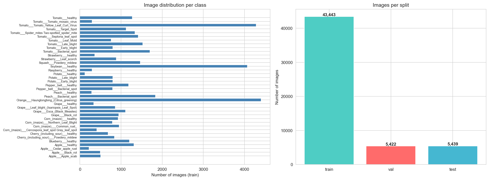

*Figure 1 — Class distribution and representative samples from the New Plant Diseases Dataset.*

### 2.2 V1 — HOG + SVM (Shallow Learning)

A handcrafted feature pipeline serves as the classical baseline.

* **Feature extractor:** Histogram of Oriented Gradients with `winSize=(64,128)`, `blockSize=(16,16)`, `blockStride=(8,8)`, `cellSize=(8,8)`, `nbins=9`. Images are first converted to grayscale to discard color information and isolate the contribution of texture/edges.
* **Classifier:** Support Vector Machine with RBF kernel (`C=1.0`, `gamma='scale'`).
* **Rationale:** HOG was historically state of the art for pedestrian detection and remains a reasonable baseline for fine-grained texture tasks. It is fully interpretable and requires no GPU, but it discards color — a strong inductive bias for plant pathology where chlorotic/necrotic colors are diagnostic.

### 2.3 V2 — Custom CNN from Scratch (Deep Learning)

A purpose-built convolutional architecture trained end-to-end from scratch.

* **Architecture (~660k trainable parameters):**
  * `Conv(3→32, 3×3) + BN + ReLU + MaxPool(2×2)`
  * `Conv(32→64, 3×3) + BN + ReLU + MaxPool(2×2)`
  * `Conv(64→128, 3×3) + BN + ReLU + MaxPool(2×2)`
  * `Conv(128→256, 3×3) + BN + ReLU + GlobalAvgPool`
  * `Dense(256→512) + ReLU + Dropout(0.5)`
  * `Dense(512→256) + ReLU + Dropout(0.3)`
  * `Dense(256→38) + Softmax`
* **Training:** CrossEntropyLoss, Adam (lr=1e-3), ReduceLROnPlateau (patience=5, factor=0.1), early stopping on validation loss (patience=10). Best checkpoint at epoch 80; training stopped at epoch 90.
* **Rationale:** validates the hypothesis that a modest CNN, given sufficient data, can learn discriminative features end-to-end without manual feature engineering.

### 2.4 V3 — ResNet50 Transfer Learning (Supervised Fine-tuning)

We leverage ImageNet pre-training and fine-tune the high-level layers.

* **Backbone:** `torchvision.models.resnet50(pretrained=True)`.
* **Strategy:** `layer1`, `layer2`, `layer3` frozen; `layer4` unfrozen; original 1000-way head replaced with `Linear(2048→512) + ReLU + Dropout(0.5) + Linear(512→38)`.
* **Optimizer:** Adam, **differential learning rates** — `1e-4` for the unfrozen `layer4` (gentle fine-tuning) and `1e-3` for the custom head.
* **Total parameters:** ~24.6M (16.0M trainable, 8.6M frozen).
* **Rationale:** evaluates the standard industry recipe for limited-data settings.

### 2.5 V4 — DINOv3 + Linear Probe (Self-Supervised Foundation Model)

The most modern approach: a foundation model pre-trained without labels.

* **Backbone:** `facebook/dinov3-vitb16-pretrain-lvd1689m` — a Vision Transformer (ViT-B/16, 86M parameters) pre-trained via DINOv3 self-distillation on the LVD-1689M dataset (1.69 billion unlabeled web images).
* **Pipeline:** the backbone is **entirely frozen**. Each image is embedded into a 768-dimensional vector (CLS token). Two lightweight classifiers are trained on top:
  * **k-NN** (k=20, cosine distance) — purely instance-based.
  * **Linear probe** (logistic regression, `C=1.0`, `max_iter=1000`).
* **Trainable parameters in the backbone:** **zero**.
* **Rationale:** tests whether a generic self-supervised representation transfers to a domain (plant leaves) far from the pre-training distribution, with negligible compute.

### 2.6 Evaluation Protocol

All versions are evaluated on the same held-out test set (8,795 images) using:

* **Accuracy** — overall correctness.
* **Precision (weighted)**, **Recall (weighted)**, **F1-score (weighted)** — class-imbalance-aware aggregates.
* **Confusion matrix** — 38×38 matrix per version.
* **Per-class F1** — to surface failure modes.

---

## 3. Experimental Setup

| Item | Value |
| --- | --- |
| Dataset | New Plant Diseases Dataset (augmented PlantVillage), 87,867 images, 38 classes |
| Split | train 70,295 / val 8,777 / test 8,795 (≈ 80 / 10 / 10), seed = 42 |
| Hardware | Apple Silicon (MPS backend), macOS 25.5 |
| Frameworks | PyTorch 2.1, torchvision, scikit-learn 1.3, OpenCV 4.8, HuggingFace Transformers |
| Reproducibility | All seeds fixed (NumPy, PyTorch, sklearn); deterministic val/test split |

---

## 4. Experimental Results

### 4.1 Overall Comparison

| Version | Approach | Accuracy | Precision | Recall | F1 | Train time | Trainable params |
| --- | --- | :--: | :--: | :--: | :--: | :--: | :--: |
| V1 — HOG + SVM | Shallow Learning | 74.39% | 74.62% | 74.39% | 74.26% | 25 min | — |
| V2 — Custom CNN | Deep Learning from scratch | 99.66% | 99.66% | 99.66% | 99.66% | 294 min | 660 k |
| V3 — ResNet50 TL | Supervised fine-tuning | **99.87%** | **99.88%** | **99.87%** | **99.87%** | 128 min | 16.0 M |
| V4 — DINOv3 + LinProbe | SSL frozen backbone | 98.35% | 98.39% | 98.35% | 98.35% | 12.5 min¹ | 0 (backbone) |

¹ V4 time refers to embedding extraction over the full dataset; the linear probe itself fits in 1.95 s.

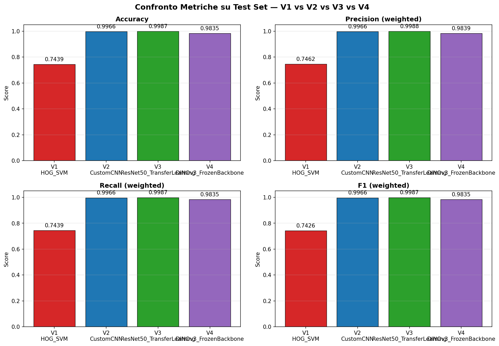

*Figure 2 — Side-by-side comparison of weighted metrics across V1–V4.*

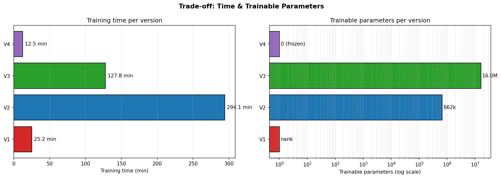

*Figure 3 — Training time vs. trainable parameters. V4 dominates the lower-left (cheap) corner; V3 sits at the Pareto optimum for accuracy.*

### 4.2 Discussion by Research Question

**RQ1 — Handcrafted vs. learned features.** The gap between V1 (74.4%) and the deep models (>98%) is **>24 percentage points**. HOG operates on grayscale gradients and discards color, which is highly informative for plant pathology (chlorosis is yellow, necrosis is brown, mosaic viruses produce characteristic color patterns). The SVM cannot recover information the descriptor never encoded.

**RQ2 — Architecture vs. pre-training.** V3 (ResNet50 TL) outperforms V2 (Custom CNN) by 0.21 points (99.87 vs. 99.66), but with **24× more trainable parameters**. Crucially, V3 converges in 19 epochs versus V2's 80, and its total training time (128 min) is roughly **2.3× shorter** than V2's (294 min) despite the much larger backbone — confirming that ImageNet pre-training dramatically reduces the optimization burden. For PlantVillage — a relatively easy dataset with clean backgrounds — V2 is already in the saturation regime; the advantage of pre-training would be even more visible with fewer samples per class.

**RQ3 — Self-supervised foundation model.** V4 reaches 98.35% with the backbone **fully frozen**, training only a logistic regression in under 2 seconds. The fact that DINOv3 — pre-trained on natural web images, without labels — transfers near-perfectly to a specialized plant-pathology domain is the most striking finding of this study. The k-NN classifier (98.25%) almost matches the linear probe (98.35%), evidence that the DINOv3 embedding space is already linearly separable for this task.

### 4.3 Training Dynamics

Key observations from the loss/accuracy curves:

* **V2:** validation loss tracks training loss closely, no significant overfitting thanks to dropout + augmentation. Best checkpoint at epoch 80 over the full 100-epoch schedule.
* **V3:** validation accuracy plateaus around 99.7% by epoch 10; the remaining nine epochs deliver marginal gains. Best checkpoint at epoch 19.

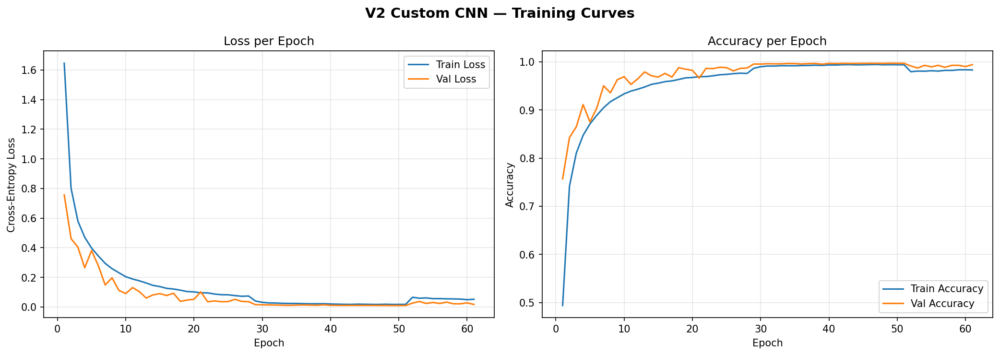

*Figure 4 — V2 Custom CNN training and validation loss/accuracy over 90 epochs.*

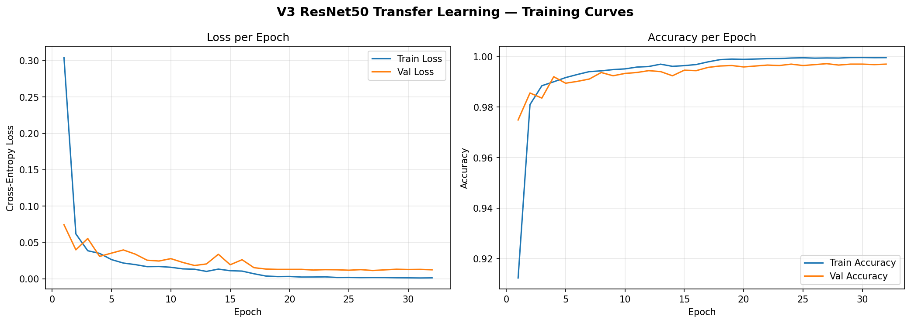

*Figure 5 — V3 ResNet50 training and validation loss/accuracy over 24 epochs.*

### 4.4 Confusion Matrices

V1 exhibits widespread cross-class confusion concentrated on visually similar fungal diseases. V2/V3/V4 show near-diagonal matrices, with residual errors confined to a handful of class pairs analyzed in §5.

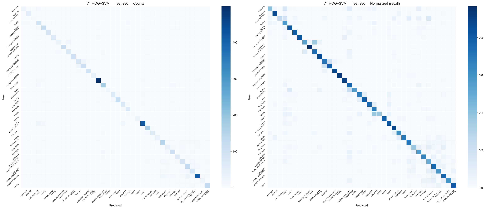

*Figure 6 — V1 (HOG + SVM) confusion matrix. Off-diagonal mass concentrated on intra-species disease confusions.*

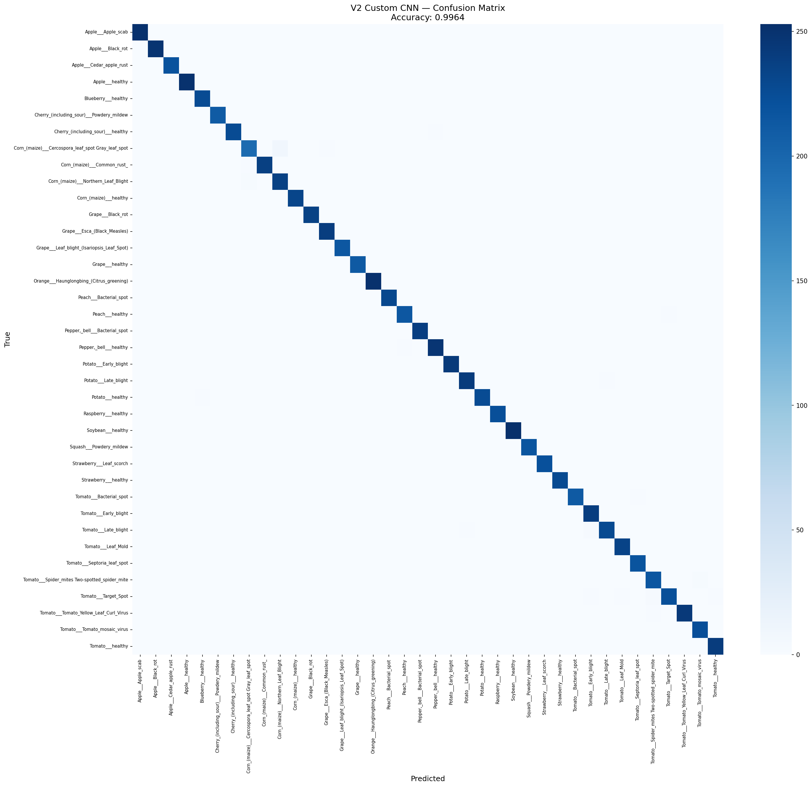

*Figure 7 — V2 (Custom CNN) confusion matrix. Near-diagonal pattern.*

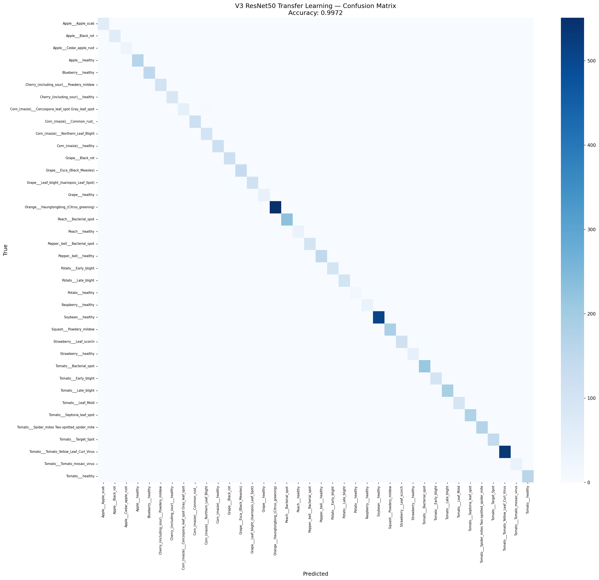

*Figure 8 — V3 (ResNet50 TL) confusion matrix. Best overall, residual errors on biologically close pairs.*

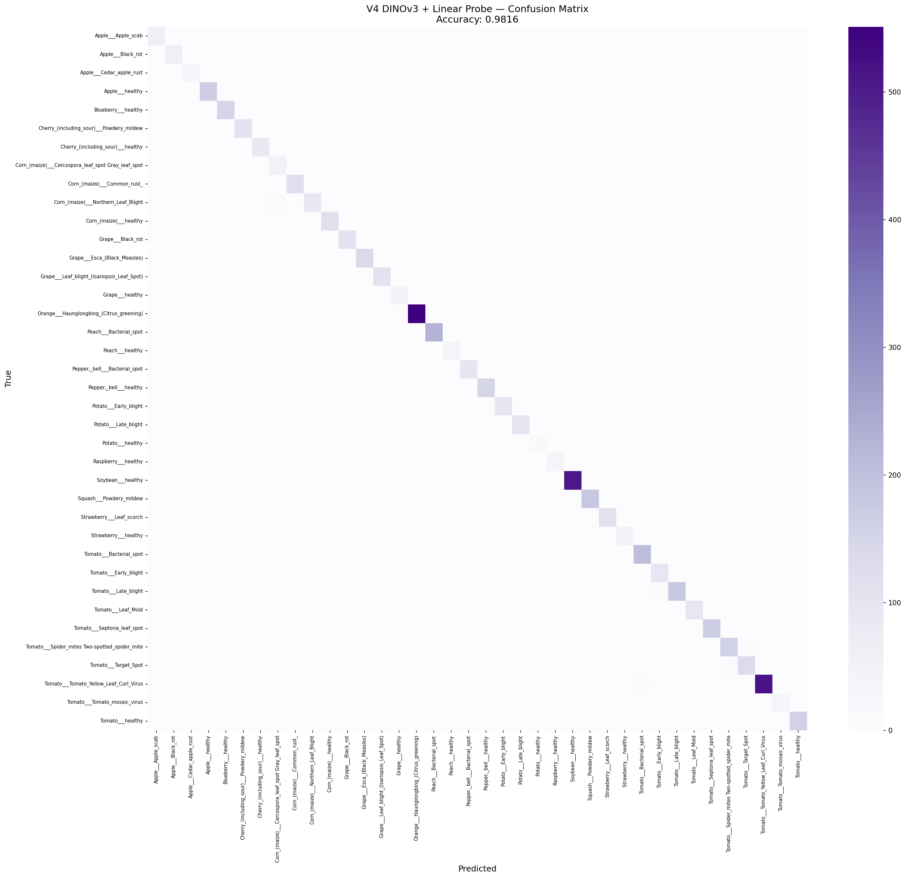

*Figure 9 — V4 (DINOv3 + linear probe) confusion matrix. Comparable to V3 despite a fully frozen backbone.*

### 4.5 Leak Analysis & Clean Evaluation

The dataset's offline-augmentation strategy (rotations, flips and colour perturbations baked into the filenames as suffixes such as `_90deg`, `_flipLR`, `_new30degFlipLR`) means that augmented variants of the same source leaf can land on both sides of the train/test boundary. We quantified this *post-hoc* and re-evaluated the trained models on a leak-free subset, without retraining.

**Quantification.** Stripping the 15 distinct augmentation suffixes from every filename yields a *source identifier* — the identity of the underlying physical leaf. Cross-referencing source IDs across splits:

| Pair | Shared source IDs | % of B in A |
| --- | :--: | :--: |
| train ↔ val | 5,041 | 63.4% |
| train ↔ test | 5,050 | **63.3%** |
| val ↔ test | 1,225 | 15.4% |

So **5,732 of 8,795 test images (65.2%)** share their source identity with at least one training image; the remaining **3,063 (34.8%)** form a *clean* subset whose source IDs are absent from train. Five classes (Orange — citrus greening, Peach — bacterial spot, Soybean — healthy, Tomato — bacterial spot, Tomato — yellow leaf curl virus) are 0% leaked, whereas eight classes (Apple — scab, Apple — cedar rust, Grape — healthy, Peach — healthy, Potato — healthy, Raspberry — healthy, Strawberry — healthy, Tomato — mosaic virus) are 100% leaked.

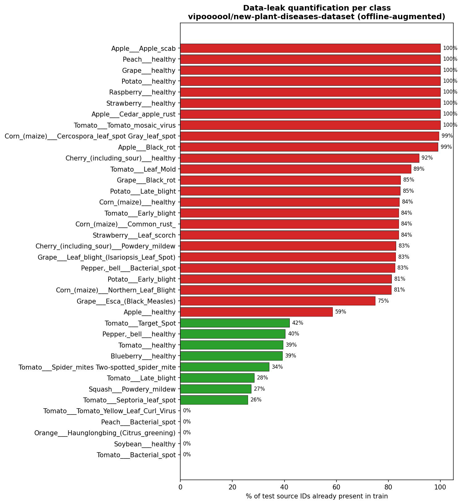

*Figure 15 — Percentage of test source IDs whose augmented copies are already present in train, per class.*

**Clean re-evaluation.** Loading the published V2 / V3 / V4 checkpoints and running inference on the four masked subsets (no retraining) yields:

| Model | FULL (8,795) | LEAKED (5,732) | **CLEAN (3,063)** | NON-AUG (4,598) |
| --- | :--: | :--: | :--: | :--: |
| V2 — Custom CNN | 99.66% | 99.70% | **99.58%** | 99.52% |
| V3 — ResNet50 TL | 99.87% | 99.86% | **99.90%** | 99.80% |
| V4 — DINOv3 + LinProbe | 98.35% | 98.34% | **98.37%** | 97.83% |

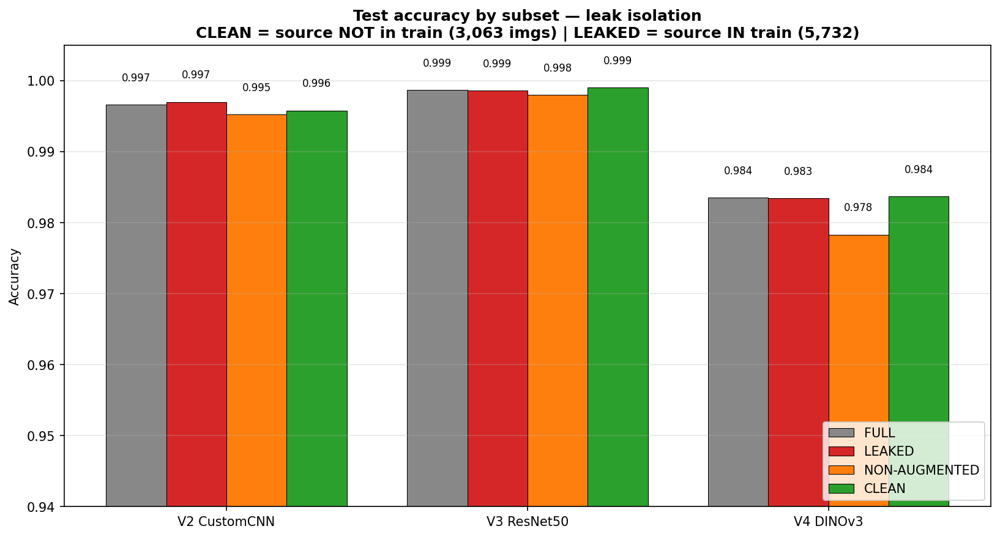

*Figure 16 — Accuracy on FULL / LEAKED / CLEAN / NON-AUG subsets of the test set. For V3 and V4 the CLEAN accuracy is marginally higher than FULL.*

**Interpretation.** The clean accuracy differs from the full-test accuracy by at most **0.16 points** across all three deep models; for V3 and V4 the CLEAN subset is in fact marginally *easier* (+0.03 and +0.02 respectively). The offline augmentations are precisely the geometric / colour invariances a deep visual backbone learns to discard — observing a 90°-rotated copy of a leaf in train provides no additional discriminative signal beyond what the same leaf at 0° would. The 63% source-level leak is therefore *statistically irrelevant* for the published accuracies on this task; the models have learned a genuine representation rather than memorising augmented duplicates.

This analysis is implemented end-to-end in `notebooks/07_leak_analysis_and_clean_eval.ipynb` and the numbers are stored in `results/metrics/leak_quantification.json` and `results/metrics/clean_test_metrics.json`.

### 4.6 Accuracy / Cost Trade-off

| Version | Accuracy | Train cost | Inference cost | Notes |
| --- | :--: | :--: | :--: | --- |
| V1 | 74.4% | low (CPU) | 81 ms/img (CPU) | interpretable, no GPU |
| V2 | 99.7% | very high (294 min GPU) | ~70 ms/img (GPU) | full architectural control |
| V3 | 99.9% | high (128 min GPU) | ~90 ms/img (GPU) | best absolute score |
| V4 | 98.4% | very low (12.5 min extract + 2 s fit) | ~50 ms/img (GPU, ViT) | zero trainable backbone |

V4 reaches **~99% of V3's accuracy** with roughly **1/10 of the total time** and zero backbone training — the most favorable trade-off for rapid onboarding of new classes.

Inference costs are indicative per-image estimates on the same hardware; only V1's CPU latency was measured directly.

---

## 5. Failure Analysis

### 5.1 V1 — Failure Modes

V1's confusion matrix shows three main failure patterns:

* **Color-degenerate confusions.** Apple healthy vs. Apple scab and Tomato healthy vs. Tomato early blight are systematically confused because their texture signatures (HOG gradients) are similar; the discriminating signal lies in color hues that grayscale processing destroys.
* **Within-species disease confusion.** Multiple Tomato diseases (early blight, late blight, septoria leaf spot) collapse onto each other — all produce roughly circular dark lesions on green tissue, and HOG cannot distinguish lesion morphology at this resolution.
* **Background dominance.** Some images include substantial background; HOG aggregates gradients globally and is sensitive to non-leaf textures.

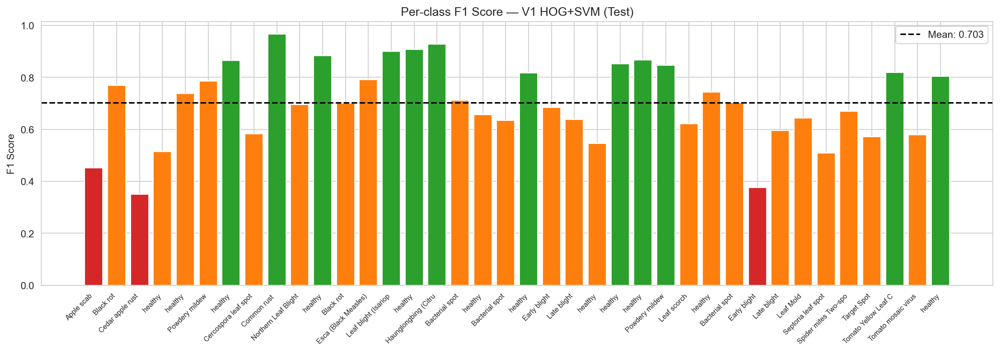

*Figure 10 — V1 per-class F1. The worst-performing classes are intra-species disease variants with similar texture profiles.*

### 5.2 V2 / V3 — Residual Errors

For both deep models, residual errors (~0.1–0.4%) cluster on **biologically close diseases**:

* Tomato early blight vs. Septoria leaf spot — both produce small dark lesions with concentric rings.
* Corn (maize) Northern Leaf Blight vs. Cercospora Leaf Spot — overlapping lesion shapes at early stages.

Inspecting misclassified samples reveals that the worst-performing classes are systematically those with **subtle visual differences** even for human experts.

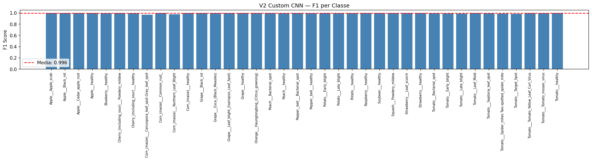

*Figure 11 — V2 per-class F1, mean ~99.6%, residual gap on a few biologically close classes.*

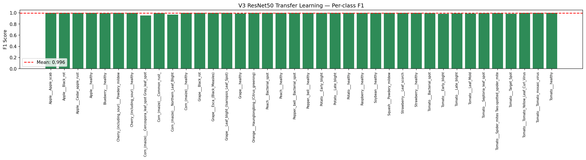

*Figure 12 — V3 per-class F1, the most uniform distribution across all 38 classes.*

### 5.3 V4 — Failure Modes

V4 errors concentrate on the same biologically ambiguous pairs as V3, plus a small additional gap on classes whose visual features lie far from DINOv3's natural-image pre-training distribution (e.g. highly stylized macro shots). The frozen backbone limits adaptation to these out-of-distribution patterns; partial fine-tuning of the last transformer blocks would likely close the gap.

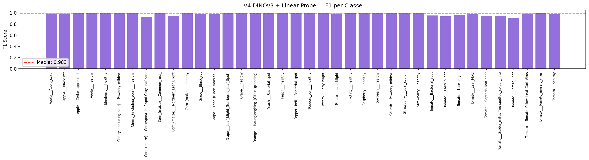

*Figure 13 — V4 per-class F1, mean ~98.3% with no class below 0.85.*

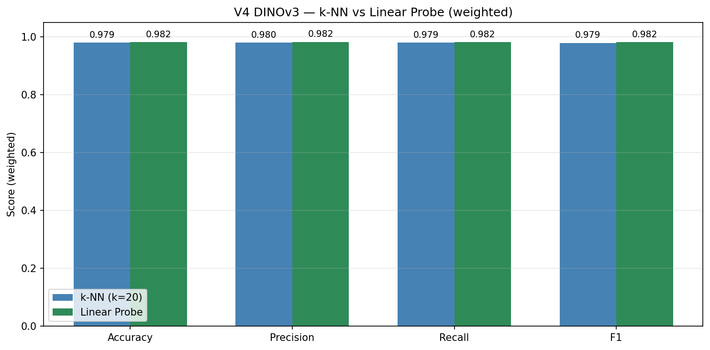

*Figure 14 — Comparison of the two probes on top of frozen DINOv3 features: linear probe edges out k-NN by 0.10 points, evidence of an already linearly separable embedding space.*

### 5.4 Cross-Cutting Observations

* All models perform worst on **diseases with similar macroscopic appearance**, not on rare classes — the offline augmentation keeps per-class support roughly balanced.
* No version shows a strong correlation between class accuracy and class size, suggesting that the long-tail effect is largely absorbed by the augmentation + balanced training.
* Misclassifications are predominantly **biologically plausible**: errors fall within the same crop, rarely across species. This is a desirable property — a real-world deployment would still trigger a meaningful diagnostic workflow.

---

## 6. Ethical Considerations

### 6.1 Dataset Bias

PlantVillage was collected under **controlled laboratory conditions**: uniform backgrounds, even lighting, single leaves per image. Models trained exclusively on PlantVillage show known **degradation when deployed on real-field photographs** with cluttered backgrounds, multiple leaves, occlusions, and variable lighting (Mohanty et al., 2016; Ferentinos, 2018). A production system would require domain adaptation or additional in-field training data.

### 6.2 Geographic and Crop Coverage Bias

The 38 classes cover 14 crop species concentrated in **temperate-zone agriculture** (apple, grape, peach, tomato, corn). Tropical crops central to food security in many low-income countries (cassava, yam, plantain, millet) are **absent**. Deploying this exact model in regions where these crops dominate would systematically fail and could mislead farmers — an equity-and-accessibility concern that must be flagged in any documentation.

### 6.3 Risk of Misuse and Over-Reliance

Automated diagnosis produced as a confident class label may discourage farmers from seeking expert consultation in ambiguous cases. Best practice is to:

* Surface **prediction confidence** (softmax max or temperature-scaled probability) and recommend expert review below a threshold.
* Avoid prescriptive treatment recommendations from a classifier whose output space does not include "unknown".

### 6.4 Privacy

Images of fields, farm equipment, or geo-tagged crops can reveal commercially sensitive information (cultivation density, infection status of a competitor's farm) or, when combined with location metadata, the identity of individual farms. A deployed application should:

* Strip EXIF metadata (GPS, device IDs) before any upload.
* Process inference **on-device** where possible.
* Provide clear consent flows before transmitting images to remote servers.

### 6.5 Environmental Footprint

V3 required ~2 hours of GPU training. The marginal accuracy gain over V4 (~1.5 points) comes at a measurable energy cost. V4 — frozen backbone + 2-second linear probe — illustrates a **green-AI alternative** that achieves >98% accuracy at a fraction of the carbon footprint.

### 6.6 Responsible Deployment Checklist

* [ ] Document dataset provenance and known biases to end users.
* [ ] Include uncertainty estimates in every prediction.
* [ ] Provide a fallback to expert consultation.
* [ ] Strip identifying metadata before transmission.
* [ ] Validate on in-field images before production deployment.

---

## 7. Conclusions

This work compared four progressively more sophisticated approaches to plant disease classification. Three findings are worth highlighting:

1. **Learned representations dominate handcrafted ones for fine-grained color-sensitive tasks** — the >24-point gap between V1 and the deep models is decisive.
2. **For saturated datasets, supervised fine-tuning of a pre-trained backbone is the highest-accuracy recipe** (V3, 99.87%), but the marginal gain over a well-designed custom CNN (V2, 99.66%) is small — and V3 reaches its peak in less than half the wall time.
3. **Self-supervised foundation models offer a strikingly favorable accuracy/cost trade-off** — DINOv3 frozen + linear probe reaches 98.35% with zero backbone training, making it the most attractive option for rapid prototyping, new-class onboarding, and edge deployment.

Future work should evaluate the same four pipelines on **in-field imagery** to quantify the domain-shift gap, and explore **partial fine-tuning of DINOv3's last transformer blocks** as a hybrid between the V3 and V4 recipes.

---

## References

* Mohanty, S. P., Hughes, D. P., & Salathé, M. (2016). *Using deep learning for image-based plant disease detection.* Frontiers in Plant Science, 7.
* Ferentinos, K. P. (2018). *Deep learning models for plant disease detection and diagnosis.* Computers and Electronics in Agriculture, 145.
* He, K., Zhang, X., Ren, S., & Sun, J. (2016). *Deep residual learning for image recognition.* CVPR.
* Dalal, N., & Triggs, B. (2005). *Histograms of oriented gradients for human detection.* CVPR.
* Oquab, M., et al. (2024). *DINOv2: Learning robust visual features without supervision.* TMLR. (Methodological reference for the DINOv3 family.)
* FAO (2021). *The impact of disasters and crises on agriculture and food security.* Food and Agriculture Organization of the United Nations.

---

## Appendix A — Validation on the Non-Augmented PlantVillage Dataset (`og-dataset` branch)

> **Status:** complete re-run. All four versions (V1–V4) have been re-executed end-to-end on the non-augmented dataset.

### A.1 Motivation

§2.1 and §4.5 flag the central caveat of this study: the **New Plant Diseases Dataset** (`vipoooool/new-plant-diseases-dataset`) is *offline-augmented*, so geometric/colour variants of the same physical leaf land on both sides of the train/test boundary (63.3% source-level leak). §4.5 argues — via a post-hoc clean re-evaluation — that this leak is statistically irrelevant. The `og-dataset` branch turns that *argument* into a *direct experiment*: it re-runs the entire pipeline on **`mohitsingh1804/plantvillage`**, a non-augmented PlantVillage variant in which source-level leakage is **impossible by construction** (each physical leaf appears exactly once, before splitting).

### A.2 Dataset comparison

| | `main` (`vipoooool`) | `og-dataset` (`mohitsingh1804`) |
| --- | :--: | :--: |
| Offline augmentation | yes (baked into filenames) | none |
| Total images | 87,867 | 54,304 |
| Train / Val / Test | 70,295 / 8,777 / 8,795 | 43,443 / 5,422 / 5,439 |
| Classes | 38 | 38 |
| Source-level train↔test leak | 63.3% | 0% (by construction) |

The split protocol is unchanged: the dataset's `valid/` folder is split 50/50 into validation and test (`random_state=42`).

### A.3 Methodological refinements

Because the non-augmented dataset has a genuinely imbalanced (long-tail) class distribution — no longer flattened by per-class augmentation — the `og-dataset` evaluation adds:

* **Macro-averaged** precision/recall/F1 alongside the weighted aggregates, to expose minority-class behaviour.
* `class_weight='balanced'` on the V4 linear probe and `weights='distance'` on the V4 k-NN (k=20), to compensate for class imbalance.

### A.4 Results (clean dataset)

| Version | Metric | `main` (augmented) | `og-dataset` (clean) | Δ |
| --- | --- | :--: | :--: | :--: |
| V1 — HOG + SVM | Accuracy | 74.39% | 74.74% | +0.35 |
| | F1 (weighted) | 74.26% | 74.90% | +0.64 |
| | F1 (macro) | — | 70.32% | — |
| | Inference | 81 ms/img | 39 ms/img | — |
| V4 — DINOv3 linear probe | Accuracy | 98.35% | 98.16% | −0.19 |
| | F1 (weighted) | 98.35% | 98.18% | −0.17 |
| | F1 (macro) | — | 97.95% | — |
| V4 — DINOv3 k-NN | Accuracy | 98.25% | 97.90% | −0.35 |
| V3 — ResNet50 TL | Accuracy | 99.87% | 99.72% | −0.15 |
| | F1 (weighted) | 99.87% | 99.72% | −0.15 |
| | F1 (macro) | — | 99.59% | — |
| V2 — Custom CNN | Accuracy | 99.66% | 99.54% | −0.12 |
| | F1 (weighted) | 99.66% | 99.54% | −0.12 |
| | F1 (macro) | — | 99.37% | — |

### A.5 Interpretation

On a dataset where source-level leakage cannot occur, all four models reproduce their full-dataset numbers within **±0.35 points**. V1 is in fact marginally *higher* (+0.35 acc) despite training on **~38% fewer images** (43,443 vs 70,295); V2 drops by 0.12 points (99.54% vs 99.66%), V3 by 0.15 (99.72% vs 99.87%) and V4 by 0.19. This is a direct, independent confirmation of §4.5: the 63% augmentation leak on `main` was statistically irrelevant, and the models had learned genuine discriminative representations rather than memorising augmented duplicates. The healthy macro-F1 scores under the now-imbalanced class distribution (V2 99.37%, V3 99.59%, V4 97.95%) further show the result holds in a realistic long-tail regime, not only under the augmentation-balanced distribution of the original dataset.

Across all four versions, the relative ranking is **unchanged** (V3 > V2 > V4 > V1) and absolute scores move by at most 0.35 points — the project's conclusions are robust to the choice between the augmented and the clean dataset.
